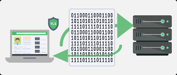
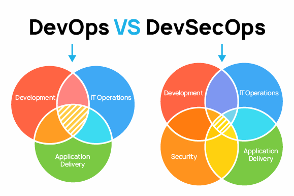

## Actividad 1 – Introducción a DevOps y DevSecOps

**Curso:** CC3S2 Desarrollo de Software  
**Estudiante:** <Cristian Diaz>  
**Fecha:** 30/08/2025  
**Tiempo invertido:** 1h:30min

**Entorno usado:**  
Navegador web (DevTools), sitios públicos para DNS/TLS y diagramado en draw.io/Excalidraw.  
Sin credenciales ni tokens.

---

### 1. DevOps vs. Cascada Tradicional

DevOps acelera y reduce riesgo en la nube al acortar ciclos de feedback, trabajar en lotes pequeños, automatizar pruebas y despliegues y alinear Dev–Ops. Esto reduce lead time, la tasa de fallos y mejora MTTR (métricas DORA [1]). La configuración externa y port binding (12-Factor [2]) favorecen la reproducibilidad entre entornos.

Un contexto donde la cascada aún es válida son los sistemas con certificaciones regulatorias estrictas, como médicos o aeronáuticos.

- Criterio 1: cada release requiere evidencia de conformidad con un checklist firmado por QA externo.
- Criterio 2: los cambios se agrupan y deben aprobarse previamente por un organismo regulador.  
  El trade-off es menor velocidad a cambio de mayor conformidad y seguridad.

---

### 2. Ciclo Tradicional y Silos

Limitaciones sin integración continua:

- Lotes grandes generan más retrabajos y regresiones.
- Colas de defectos aumentan el costo de integración tardía.

Anti-patrones:

- _Throw over the wall_: Dev entrega sin contexto, lo que aumenta MTTR.
- Seguridad tardía: los hallazgos aparecen al final y provocan bloqueos y retrabajos.

---

### 3. Principios y Beneficios de DevOps

La integración y entrega continua se basan en cambios pequeños, pruebas automatizadas cercanas al código y pipelines reproducibles. Agile aporta prácticas como las dailies y retrospectivas, que guían las decisiones de qué promover o bloquear.

Indicador observable de colaboración:

- Tiempo desde PR listo hasta despliegue en pruebas (p50).
- Se mide con los metadatos de los PR y la bitácora de despliegue.
- La meta es reducir en 30% este tiempo en cuatro iteraciones.

---

### 4. Evolución a DevSecOps

- SAST: análisis estático temprano en artefactos y dependencias.
- DAST: análisis dinámico sobre la aplicación en ejecución.

Gate mínimo de seguridad:

- SAST: 0 vulnerabilidades críticas/altas (CVSS ≥ 7.0).
- DAST: ≥ 80% de cobertura en rutas críticas.

Política de excepción: máximo 7 días, con responsable (líder técnico) y plan de mitigación temporal mediante WAF más corrección programada.

Para evitar el “teatro de seguridad”:

- Reducir hallazgos repetidos a menos del 5%.
- Remediar vulnerabilidades críticas en un máximo de 48 horas.

Marco de apoyo: NIST SSDF [3].

---

### 5. CI/CD y Estrategias de Despliegue

Estrategia: despliegue canary para un microservicio de autenticación.

**Riesgos y mitigaciones**

| Riesgo               | Mitigación                                                     |
| -------------------- | -------------------------------------------------------------- |
| Regresión funcional  | Validación de contrato y smoke tests antes de promover         |
| Costo de convivencia | Ventana de canary de 60 min y rollback automático              |
| Manejo de sesiones   | Draining de conexiones, esquemas compatibles y sticky sessions |

**KPIs de promoción/rollback**

- Técnico: errores 5xx ≤ 0.1% en la primera hora post-canary.
- Producto: conversión ≥ 95% del baseline pre-release.

Ambas métricas deben coexistir, ya que una caída en la conversión puede revelar regresiones de UX o funcionalidad aun cuando los indicadores técnicos se mantengan estables.

---

### 6. Evidencia Práctica

#### HTTP – contrato observable

  
Ejemplo: GET → 200, cabeceras `Cache-Control: max-age=3600` y `X-Request-ID`.  
La caché mejora la latencia y el request-id habilita trazabilidad.

#### DNS – nombres y TTL

  
Ejemplo: registro A, TTL=3600s. TTL alto retrasa rollbacks, TTL bajo acelera cambios pero genera más consultas.

#### TLS – seguridad en tránsito

  
Ejemplo: CN=example.com, SAN=www.example.com, válido hasta 2025.  
Si la cadena falla: errores de confianza y riesgo de MITM.

#### Puertos – estado de runtime

  
Ejemplo: 80 (HTTP) y 443 (HTTPS). La ausencia de 443 indica despliegue TLS incompleto.

#### 12-Factor

- Port binding: parametrizar externamente.
- Logs: enviados a stdout, no rotación manual.
- Anti-patrón: credenciales en el repositorio, lo que afecta reproducibilidad y seguridad.

#### Checklist de diagnóstico

| Paso | Objetivo                   | Evidencia esperada                               | Interpretación                                  | Acción                                   |
| ---: | -------------------------- | ------------------------------------------------ | ----------------------------------------------- | ---------------------------------------- |
|    1 | Validar contrato HTTP      | 2xx/3xx y cabeceras esperadas                    | 4xx/5xx o cabeceras faltantes = contrato roto   | Revisar routing/backends                 |
|    2 | Verificar DNS y TTL        | Registros A/CNAME consistentes                   | Divergencias o TTL alto = propagación lenta     | Ajustar rollback o esperar ventana       |
|    3 | Revisar TLS                | Cert válido, CN/SAN correctos, emisora confiable | Cert caducado o mismatch = errores de confianza | Renovar o corregir cadena                |
|    4 | Revisar puertos            | 80/443 expuestos por el servicio                 | 443 ausente = despliegue incompleto             | Configurar listener TLS o liberar puerto |
|    5 | Comparar canary vs control | 5xx ≤ 0.1% y p95 estable en 1h                   | KPI superado = regresión técnica                | Rollback inmediato                       |
|    6 | Logs de correlación        | Request-ID extremo a extremo                     | Falta correlación = sin trazabilidad            | Habilitar middleware de tracing          |

---

### 7. Desafíos de DevOps y Mitigaciones

- Cambios no observables → feature flags y rollback probado.
- Blast radius amplio → despliegue canary y límites de tráfico.
- Errores humanos → revisión cruzada y runbooks automatizados.

**Experimento controlado:** comparar canary vs big-bang.

- Métrica: tasa de 5xx y latencia p95 en 60 min.
- Control: release big-bang previo.
- Éxito: canary reduce fallos en ≥ 50%.
- Reversión: rollback automático si KPI supera umbral.

---

### 8. Arquitectura Mínima para DevSecOps

Flujo: Cliente → DNS → HTTP → TLS.  
Controles: políticas de caché, validación de certificados, contratos de API y rate limiting.

Principios 12-Factor aplicados:

- Configuración por entorno con diferencias mínimas y fácil auditoría.
- Logs a stdout para trazabilidad (correlación con X-Request-ID).

---

### Evidencias Incluidas

- Estado HTTP y dos cabeceras.
- Registro DNS y TTL.
- CN/SAN y vigencia del certificado TLS.
- Puertos en escucha.
- Gates de seguridad con umbrales.
- KPIs técnicos y de producto.
- Checklist operativo.
- Diagramas y capturas con marcas visuales.

---

### Trazabilidad de Commits

- Estructura de actividad 1
- Día 1 – Comparativos e imágenes base
- Día 2 – DevSecOps y estrategia de despliegue
- Día 3 – Evidencia, diagramas y entrega final
- Entrega actividad 1

---

## Referencias

[1] DORA – The Four Keys (Software Delivery Metrics). https://dora.dev/guides/dora-metrics-four-keys/  
[2] The Twelve-Factor App. https://12factor.net/  
[3] NIST SP 800-218 – Secure Software Development Framework (SSDF). https://csrc.nist.gov/pubs/sp/800/218/final  
[4] Google SRE Workbook – Canarying Releases. https://sre.google/workbook/canarying-releases/  
[5] OWASP ASVS. https://owasp.org/www-project-application-security-verification-standard/
