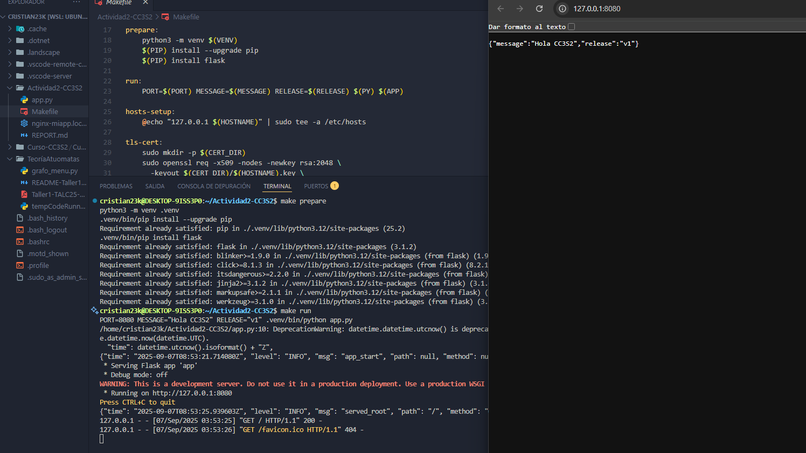
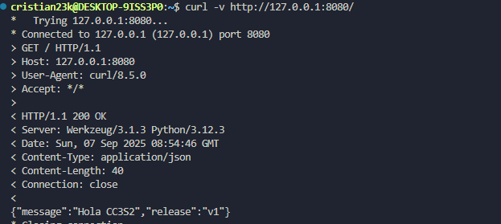
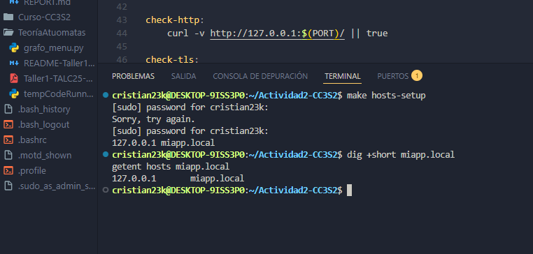

# Actividad 2 – HTTP, DNS, TLS y 12-Factor

**Curso:** CC3S2 Desarrollo de Software  
**Estudiante:** <Cristian Diaz>  
**Fecha:** <03/09/2025>

---

## 1. HTTP – Fundamentos y evidencias

- **Captura:** `curl -v http://127.0.0.1:8080/`  
  

- **Explicación:**  
  Se muestran evidencias de la ejecución de _app.py_ con variables de entorno. Al modificar `MESSAGE` y `RELEASE`, el contenido del JSON cambia, lo que demuestra la configuración dinámica de la aplicación.

---

## 2. DNS – Resolución y TTL

- **Captura:** `dig +short miapp.local`  
  

- **Explicación:**  
  La diferencia entre `/etc/hosts` y una zona DNS autoritativa es que el primero es un archivo local y estático—ideal para entornos de laboratorio—mientras que la zona DNS autoritativa permite una gestión centralizada y escalable en producción.

---

## 3. TLS – Nginx como reverse proxy

- **Captura OpenSSL:**  
  `openssl s_client -connect miapp.local:443 -servername miapp.local -brief`  
  

- **Captura curl:**  
  `curl -k https://miapp.local/`  
  

- **Snippet de nginx-miapp.local.conf (proxy_pass):**

  ```nginx
  # Formato del bloque de proxy en nginx
  location / {
      proxy_pass http://127.0.0.1:8080;
      proxy_set_header X-Forwarded-For   $remote_addr;
      proxy_set_header X-Forwarded-Proto https;
      proxy_set_header X-Forwarded-Host  $host;
  }
  ```

---

## 4. 12-Factor

- Evidencia port binding, configuración por entorno y logs a stdout.

## 5. Operación reproducible

### Tabla Comando → Resultado esperado

| Comando            | Resultado esperado                                                                          |
| ------------------ | ------------------------------------------------------------------------------------------- |
| `make prepare`     | Crea el entorno virtual `.venv` e instala Flask.                                            |
| `make run`         | Levanta la app Flask en el puerto definido por la variable `PORT` y muestra logs en stdout. |
| `make check-http`  | Respuesta JSON en `http://127.0.0.1:8080/` con código 200.                                  |
| `make dns-demo`    | `dig` y `getent` resuelven `miapp.local` a `127.0.0.1`.                                     |
| `make tls-cert`    | Genera certificado y llave autofirmados en `/etc/nginx/certs/`.                             |
| `make nginx`       | Copia configuración de Nginx, valida con `nginx -t` y reinicia el servicio.                 |
| `make check-tls`   | Handshake TLS exitoso en `https://miapp.local:443` con `openssl` y `curl -k`.               |
| `make check-ports` | Muestra que los puertos 8080 (Flask) y 443 (Nginx TLS) están en escucha.                    |
| `make logs-demo`   | Redirige logs de la app a `stdout` y los guarda en `imagenes/app-stdout.log`.               |

---

## Preguntas guía

**HTTP – Idempotencia de métodos**  
La idempotencia significa que ejecutar varias veces un mismo método da el mismo resultado. Ejemplo: `PUT` con el mismo cuerpo no cambia nada tras la primera ejecución, por lo que es seguro en health checks y reintentos. En cambio, `POST` no es idempotente porque cada petición puede crear un recurso nuevo y duplicar datos.

**DNS – Uso de `/etc/hosts`**  
`/etc/hosts` es útil en laboratorio porque permite forzar la resolución de nombres sin necesidad de un DNS real. En producción no es adecuado ya que no escala, requiere edición manual en cada host y no ofrece mecanismos de propagación ni TTLs.

**DNS – Rol del TTL**  
El TTL define cuánto tiempo se guarda en caché un registro DNS. TTLs cortos permiten rollbacks y cambios rápidos, pero aumentan el tráfico de consultas. TTLs largos reducen carga, pero hacen más lentas las actualizaciones o correcciones.

**TLS – Rol del SNI**  
El SNI (Server Name Indication) permite que un cliente especifique el nombre de host al inicio del handshake TLS, para que el servidor seleccione el certificado correcto en entornos con hosting múltiple. Se comprobó con `openssl s_client -servername miapp.local`.

**12-Factor – Logs y configuración**  
Enviar logs a `stdout` en lugar de a archivos facilita la agregación en contenedores y pipelines CI/CD. La configuración por entorno (variables) permite que la misma app se ejecute en distintos ambientes (dev, test, prod) sin modificar el código.

**Operación – Diferencia entre `ss` y `curl`**  
`curl` valida la respuesta HTTP, pero no muestra si el puerto está realmente en escucha. `ss -ltnp` en cambio revela qué procesos tienen sockets abiertos, ayudando a detectar conflictos o puertos no expuestos aunque el servicio no responda.

**Operación – Triangulación de problemas**  
Para diagnosticar incidencias se combinan:

- `curl` y `openssl` → verifican contrato HTTP/TLS.
- `dig` → comprueba resolución DNS.
- `ss -ltnp` → confirma puertos abiertos y procesos.
- `journalctl` o logs de Nginx → muestran errores de proxy, certificados o permisos.  
  Con esta triangulación se identifica rápido si la falla es de aplicación, red o configuración.

---

## Evidencias

Todas las capturas se encuentran en `/imagenes/`.
